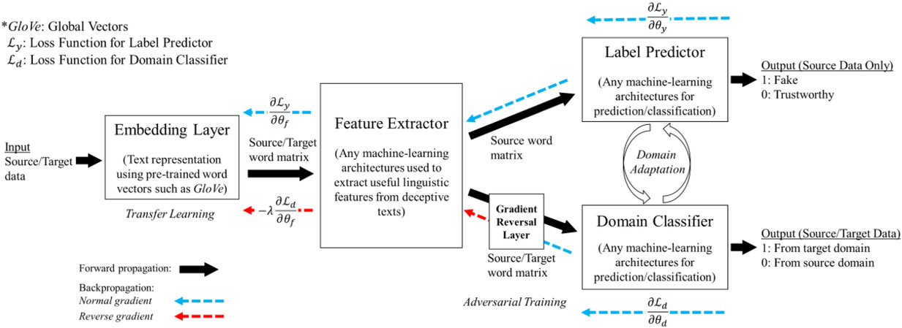

# Adversarial Domain Adaptation for Fake Content

The official implementation of paper "[Augmenting fake content detection in online platforms: A domain adaptive transfer learning via adversarial training approach](https://onlinelibrary.wiley.com/doi/full/10.1111/poms.13959)". 

## Dataset

The dataset is avaliable at `data` directory, which contains two csv data file: source.csv, target.csv.

Please note that the current dataset (source and target are sampled from [Amazon review data (2018) Magazine Subscriptions category](https://jmcauley.ucsd.edu/data/amazon_v2/categoryFiles/Magazine_Subscriptions.json.gz) and [IMDB Dataset of 50K Movie Reviews](https://www.kaggle.com/datasets/lakshmi25npathi/imdb-dataset-of-50k-movie-reviews), respectively) is provided only for development and testing purposes. To obtain the original dataset, please refer to the research paper.

### Data format:
```
Text, Label
text_1, label_1
...
text_n, lable_n 
```
## Model



The image above shows the model framework for fake content detection.


## Codes

### Dependencies

To install the required dependencies, please run the following command:

 ```
 pip install -r requirements.txt
 ```

### Code Structures

```
├── data       # Dataset directory
├── models     # Saved models directory
├── figures    # Saved figures directory
├── config.py  # All configurations
├── datasets.py   # Dataset package 
├── models.py     # Our model class (can be customized with other models)
└── transferability_score.py   # Package for calculating transferability scores
├── main.py   # Main entrance of the codes

```

Usage of `main.py`:

```
usage: main.py [-h] [--seed SEED] [--mode {TLnoDA,TLDA,TLDA_FT,cal_tran_score}] [--cuda] [--model_path MODEL_PATH] [--source_path SOURCE_PATH]
               [--target_path TARGET_PATH] [--do_train] [--batch_size BATCH_SIZE] [--lr LR] [--n_epoch N_EPOCH] [--embedding_dim EMBEDDING_DIM]
               [--n_filters N_FILTERS] [--filter_sizes FILTER_SIZES [FILTER_SIZES ...]] [--pretrained_model_path PRETRAINED_MODEL_PATH]
               [--do_test] [--test_model_epoch TEST_MODEL_EPOCH] [--cal_tran_score] [--model_no_da_path MODEL_NO_DA_PATH]
               [--model_da_path MODEL_DA_PATH] [--do_visualize] [--fig_prefix FIG_PREFIX]

optional arguments:
  -h, --help            show this help message and exit
  --seed SEED           Random seed
  --mode {TLnoDA,TLDA,TLDA_FT,cal_tran_score}
  --cuda                Enable CUDA
  --model_path MODEL_PATH
                        Model path for loading or saving
  --source_path SOURCE_PATH
                        Source dataset path
  --target_path TARGET_PATH
                        Target dataset path
  --do_train            Enable training
  --batch_size BATCH_SIZE
                        Batch size
  --lr LR               Learning rate
  --n_epoch N_EPOCH     Number of epochs
  --embedding_dim EMBEDDING_DIM
                        Embedding dimension
  --n_filters N_FILTERS
                        Number of filters
  --filter_sizes FILTER_SIZES [FILTER_SIZES ...]
                        Filter sizes
  --pretrained_model_path PRETRAINED_MODEL_PATH
                        Pre-trained model path for fine-tuning
  --do_test             Enable testing
  --test_model_epoch TEST_MODEL_EPOCH
                        Epoch of model for testing
  --cal_tran_score      Enable calculating transferability score
  --model_no_da_path MODEL_NO_DA_PATH
                        Model without domain adptation path for calculating transferability score
  --model_da_path MODEL_DA_PATH
                        Model with domain adptation path for calculating transferability score
  --do_visualize        Enable visualizing transferability score
  --fig_prefix FIG_PREFIX
                        Figure prefix
```

### 1. Transfer learning without domain adaptation (TLnoDA)

This is simple transfer learning without domain adaptation. Specifically, we train this type of model using the architecture depicted in Supporting Information Appendix B of paper by discarding the domain-classifier module and using only the source domain dataset.

To train the model, please follow the following command example:
```
python -u main.py \
    --mode TLnoDA \
    --cuda \
    --model_path models/test/TLnoDA \
    --source_path data/source.csv \
    --target_path data/target.csv \
    --do_train \
    --batch_size 32 \
    --lr 0.0001 \
    --n_epoch 5 \
    --embedding_dim 300 \
    --n_filters 100 \
    --filter_sizes 7 6 5 \
``` 

### 2. Transfer learning with domain adaptation (TLDA)

This is transfer learning with domain adaptation. We follow the procedures described in Section 3 of paper to train the model on source domain data and non-fake datain the target domains. The source domain data ensure that the model has sufficient predictive power to discriminate deceptive from trustworthy news articles, while the non-fake data in the target domains guide the training process to extract only domain invariant features.

To train the model, please follow the following command example:
```
python -u main.py \
    --mode TLDA \
    --cuda \
    --model_path models/test/TLDA \
    --source_path data/source.csv \
    --target_path data/target.csv \
    --do_train \
    --batch_size 32 \
    --lr 0.0001 \
    --n_epoch 5 \
    --embedding_dim 300 \
    --n_filters 100 \
    --filter_sizes 7 6 5 \
```

### 3. Transfer learning with domain adaptation and fine-tuning (TLDA_FT)
This is transfer learning with domain adaptation, fine-tuned with labeled data in the target domain. We use this type to illustrate that the performance of a domain adaptive model comprised of opinion-based linguistic features can be increased by supplementation with a very small number of target fake examples. 

To train the model, please follow the following command example:
```
python -u main.py \
    --mode TLDA_FT \
    --cuda \
    --model_path models/test/TLDA_FT \
    --pretrained_model_path models/test/TLDA/epoch4.pth \
    --source_path data/source.csv \
    --target_path data/target.csv \
    --do_train \
    --batch_size 32 \
    --lr 0.0001 \
    --n_epoch 5 \
    --embedding_dim 300 \
    --n_filters 100 \
    --filter_sizes 7 6 5 \
```

### Calculate transferability score

To calculate the transferability score that quantifies the domain transferability using the following equation:
$$\text { TranScore }=\cos \left(\bar{V}_{S, n o D A}$$

Please run the following example command:
```
python -u main.py \
    --mode cal_tran_score \
    --cuda \
    --source_path data/source.csv \
    --target_path data/target.csv \
    --cal_tran_score --do_visualize \
    --model_no_da_path models/test/TLnoDA/epoch4.pth \
    --model_da_path models/test/TLDA/epoch4.pth \
    --fig_prefix test_TLnoDA_TLDA > models/test/tran_score.log
```
where ``--model_no_da_path`` is the path of model without domain adptation  for calculating transferability score, while ``--model_da_path`` is the path of model with domain adptation.


## Citation

```
@article{https://doi.org/10.1111/poms.13959,
    author = {Ng, Ka Chung and Ke, Ping Fan and So, Mike K. P. and Tam, Kar Yan},
    title = {Augmenting fake content detection in online platforms: A domain adaptive transfer learning via adversarial training approach},
    journal = {Production and Operations Management},
    volume = {n/a},
    number = {n/a},
    pages = {},
    keywords = {adversarial domain adaptation, augmented AI, deception detection, fake news, transfer learning},
    doi = {https://doi.org/10.1111/poms.13959},
    url = {https://onlinelibrary.wiley.com/doi/abs/10.1111/poms.13959},
    eprint = {https://onlinelibrary.wiley.com/doi/pdf/10.1111/poms.13959},
}
```
